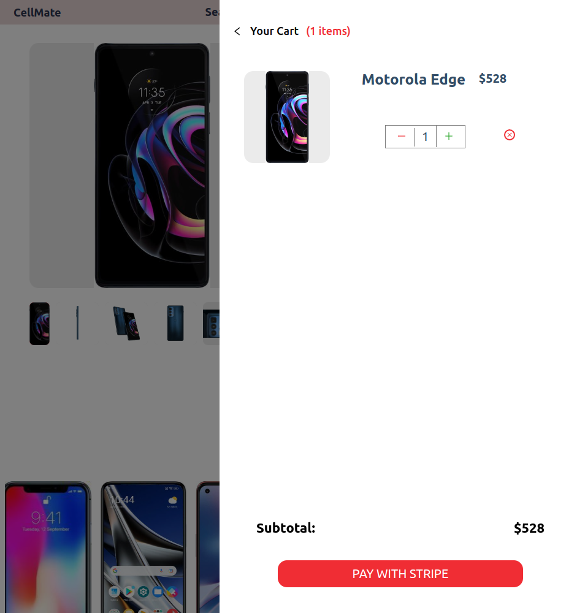

# Cellmate

# Dependencies

- @auth0/nextjs-auth0: ^1.9.0
- @babel/core: ^7.17.9
- @prisma/client: ^3.14.0
- @sanity/client: ^3.2.0
- @sanity/image-url: ^1.0.1
- @stripe/stripe-js: ^1.25.0
- canvas-confetti: ^1.5.1
- next: 12.1.0
- next-sanity-image: ^3.2.1
- prisma: ^3.14.0
- react: 17.0.2
- react-dom: 17.0.2
- react-hot-toast: ^2.2.0
- react-icons: ^4.3.1
- stripe: ^8.209.0

# Screenshots

# Getting Started

1. Create the `.env` by using `.env.example` as a reference: `cp .env.example .env`
2. Update the .env file with your correct local information
3. Install dependencies: `npm i`
4. Reset database: `npm run db:reset`
5. Run the server: `npm run dev`
6. Visit `http://localhost:3000/`

# Sanity

1. setup an account with sanity
2. grab the sanity token associated with the account
3. populate the token in `.env`
4. will need to restart the server if it is already running

# PRISMA Setup and Usage

1. run `npm i` or `npm install` to install the new packages added to package.json (prisma and @prisma/client)
2. start up vagrant
3. copy `.env.example` to `.env` and fill in the details
4. set the 'datbase name' in `.env` to be 'cellmate'
5. run `npx prisma init`
6. run `npx prisma migrate dev`
7. run `npm run seed` to populate the datbase with default user information
8. can run the prisma studio `npx prisma studio` to see the database and confirm the default test users are in the User table

# Stripe Setup and Usage

1. grab stripe publishable key and stripe secret key from you stripe account
2. populate the information in the `.env` file
3. will need to restart the server if it is already running

# AUTH0 Setup and Usage

1. run `npm i` or `npm install` to install the new packages added to package.json (prisma and @prisma/client)
2. follow along the readme file here: https://github.com/auth0/nextjs-auth0
3. populate the AUTH0 env settings file in the `.env.example` file and put it in your `.env` file
